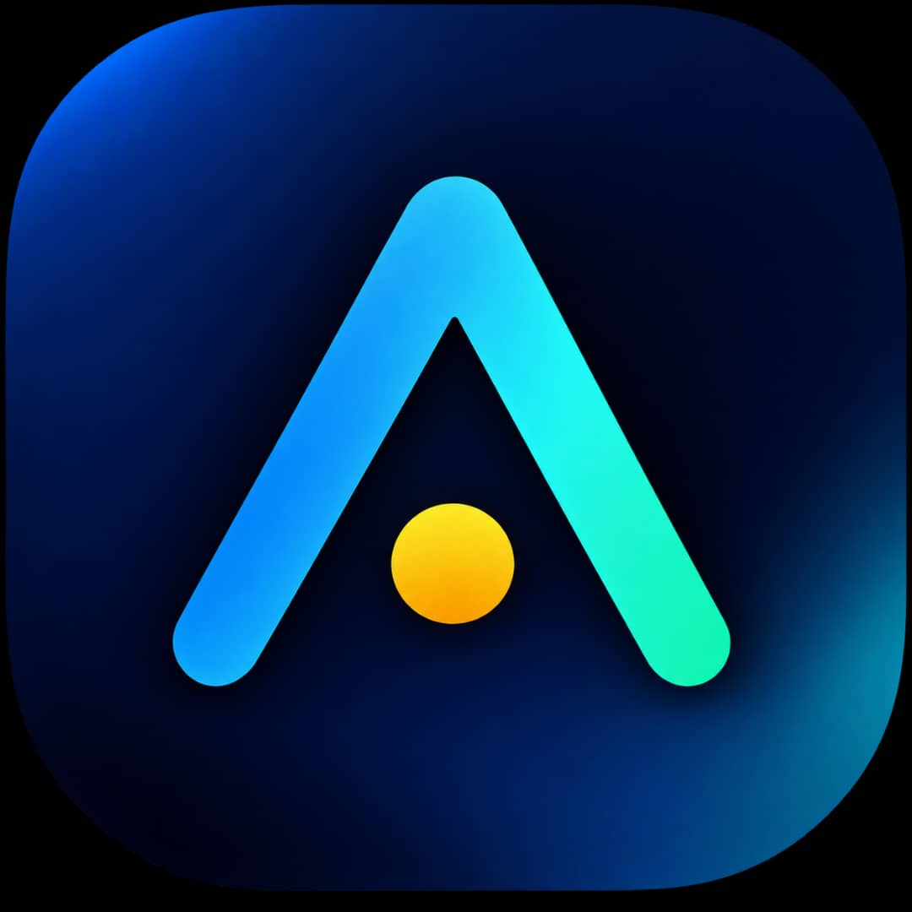
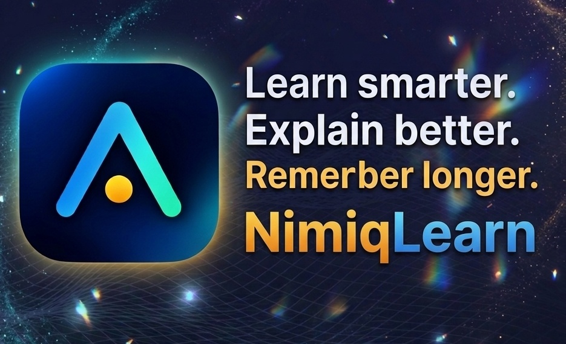
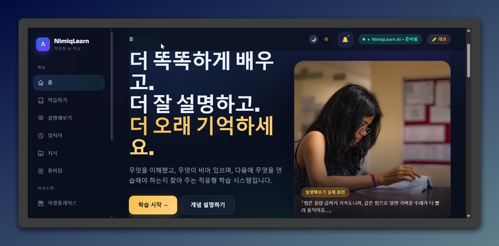
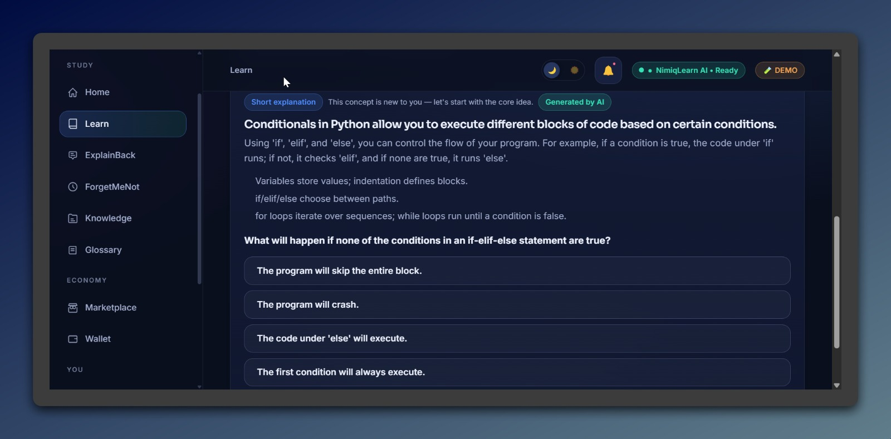
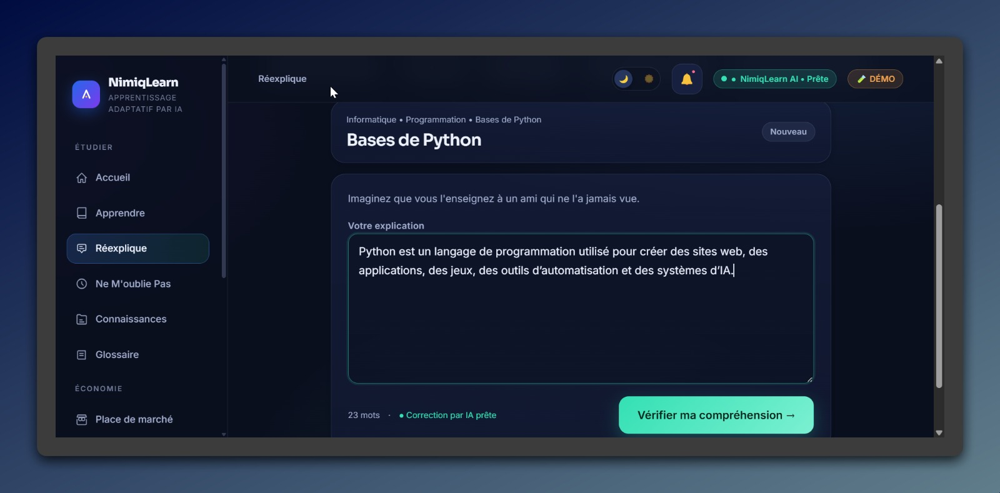
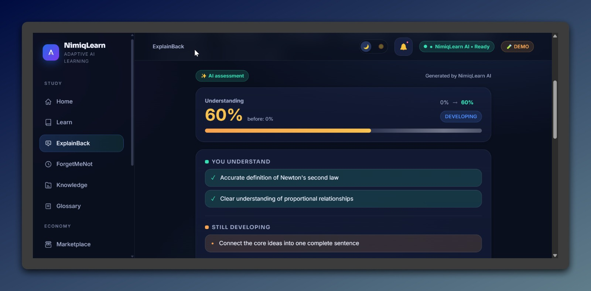
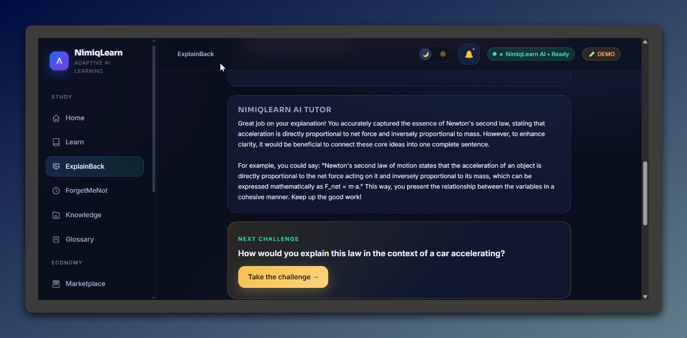

# NimiqLearn

> Explain it back. And find the misconception you didn't know you had.

| Field | Value |
| --- | --- |
| Category | Education |
| Pricing | Freemium |
| Team name | Solo |
| Team members | _Not provided — optional_ |
| X account | eric0xbt |
| Heard about it via | X |
| Contact email | israeleric414@gmail.com |
| GitHub login | @Eric-65 |
| Submitted at | 2026-09-16T16:53:57.796Z |

## Links

| Link | URL |
| --- | --- |
| Repo | [https://github.com/Eric-65/nimiqlearn](<https://github.com/Eric-65/nimiqlearn>) |
| Demo | [https://nimiqlearn-ai-educational-app.vercel.app/](<https://nimiqlearn-ai-educational-app.vercel.app/>) |
| Video | [https://youtu.be/qPjU2qBD23k?si=KR5Xhkg61pDX7VZZ](<https://youtu.be/qPjU2qBD23k?si=KR5Xhkg61pDX7VZZ>) |
| Skool post | _Not provided — optional_ |
| Social post | [https://x.com/eric0xbt/status/2100188532572594366](<https://x.com/eric0xbt/status/2100188532572594366>) |

## Description

Explain away an idea in your own words, and NimiqLearn finds the misconception that led you astray and brings it back to you until it clicks. For students and self-taught, in 10 languages, with learning packs unlockable in NIM.

## Builder story

_Not provided — optional_

## Thumbnail

## Screenshots

---

_Generated from the submission form. `submission.yaml` in this folder is the machine-readable source of truth._
