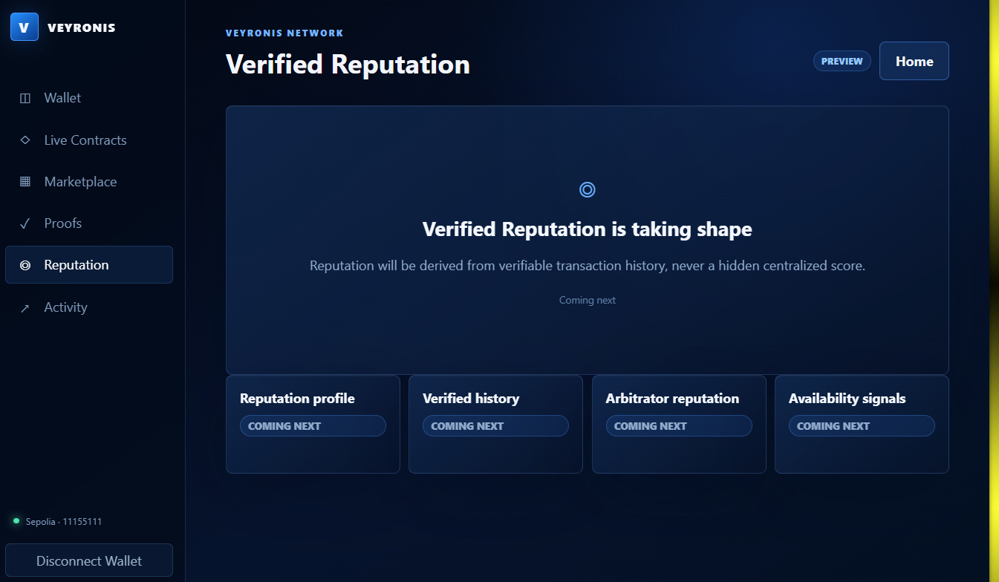
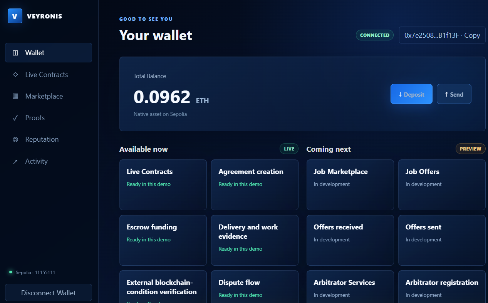
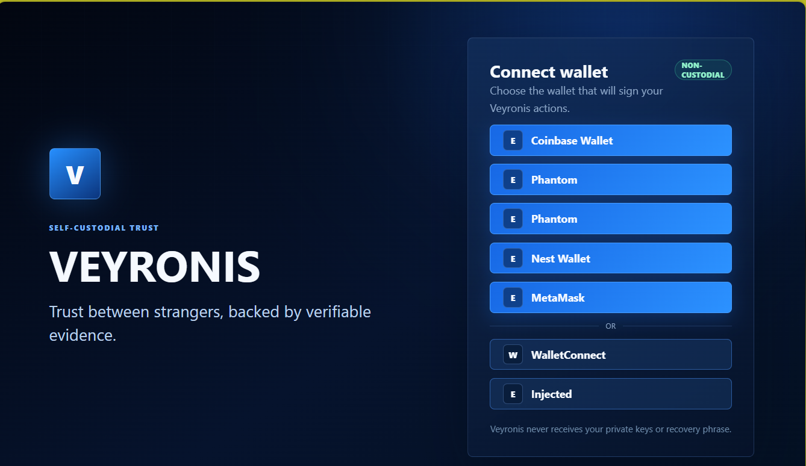
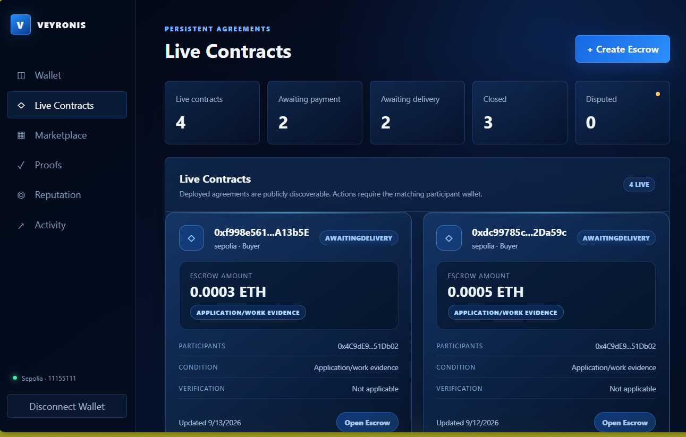
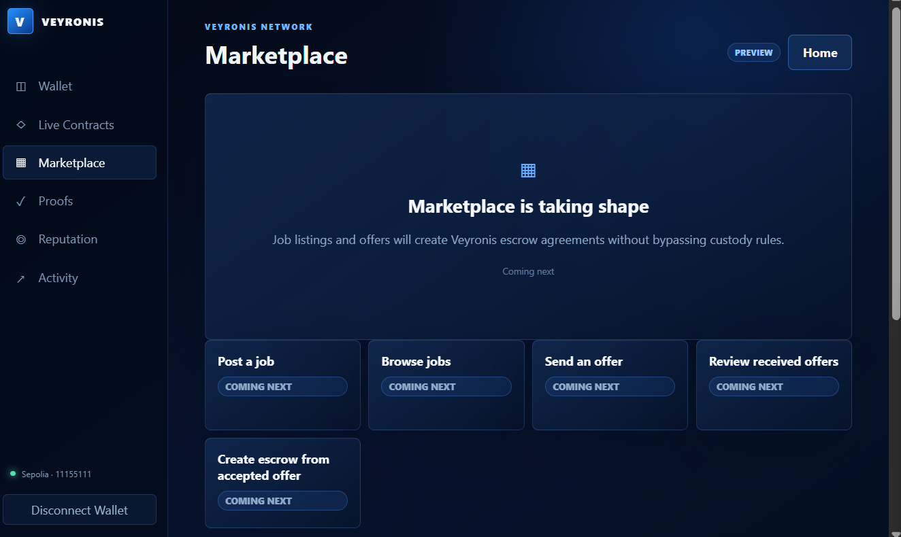

# Veyronis

> Cross-chain escrow with evidence-backed dispute resolution.

| Field | Value |
| --- | --- |
| Category | Marketplaces |
| Pricing | Free |
| Team name | Web3Launcher |
| Team members | None |
| X account | https://x.com/Web3Launcher |
| Heard about it via | From My mail. |
| Contact email | emmawills725@gmail.com |
| GitHub login | @Ogaremma |
| Submitted at | 2026-09-16T18:13:56.607Z |

## Links

| Link | URL |
| --- | --- |
| Repo | [https://github.com/Ogaremma/Veyronis](<https://github.com/Ogaremma/Veyronis>) |
| Demo | [https://veyronis-proof.vercel.app/](<https://veyronis-proof.vercel.app/>) |
| Video | [https://youtu.be/1fDdd3Rn2VU?si=wicx-i7FvmOuzPZ9](<https://youtu.be/1fDdd3Rn2VU?si=wicx-i7FvmOuzPZ9>) |
| Skool post | _Not provided — optional_ |
| Social post | [https://x.com/Web3Launcher/status/2100286413371486351?s=20](<https://x.com/Web3Launcher/status/2100286413371486351?s=20>) |

## Description

Veyronis is a self-custodial cross-chain escrow platform for safer digital transactions. Buyers and sellers create agreements, funds are held in escrow, and disputes can be resolved using verifiable evidence. Inside Nimiq Pay, Veyronis adds NIM to the escrow-creation experience t

## Builder story

I built Veyronis to address a common problem in digital transactions: buyers and sellers may agree on terms, but resolving a dispute can become difficult when evidence, payment, and trust are separated across different systems.

Veyronis combines self-custodial escrow with evidence-backed dispute resolution. A buyer creates an agreement, funds are secured in escrow, and an arbitrator can resolve a dispute using submitted evidence. Attestcoin is the current evidence-verification provider, while the verification layer is designed to support additional providers in future.

For the Nimiq Mini Apps Competition, I adapted Veyronis to Nimiq Pay so NIM becomes part of the escrow-creation experience. Inside Nimiq Pay, users authorize their Nimiq wallet and complete an explicit 0.01 NIM service-fee transaction before continuing with agreement creation.

The project is open-source and built to combine Nimiq's payment experience with an existing cross-chain escrow product.

## Thumbnail

## Screenshots

---

_Generated from the submission form. `submission.yaml` in this folder is the machine-readable source of truth._
