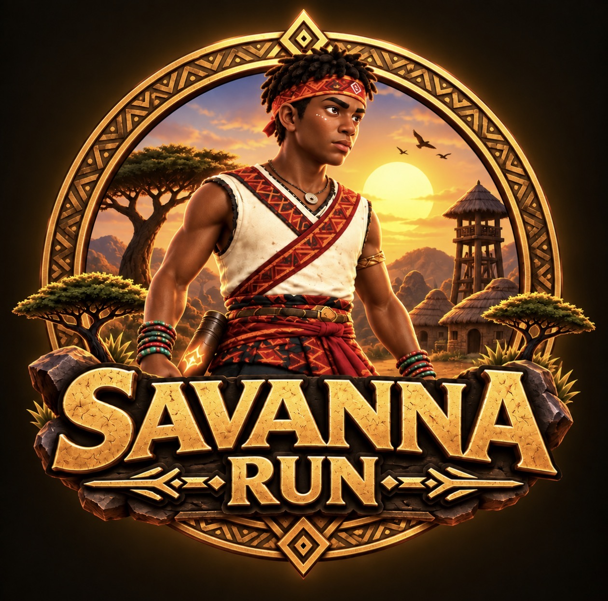
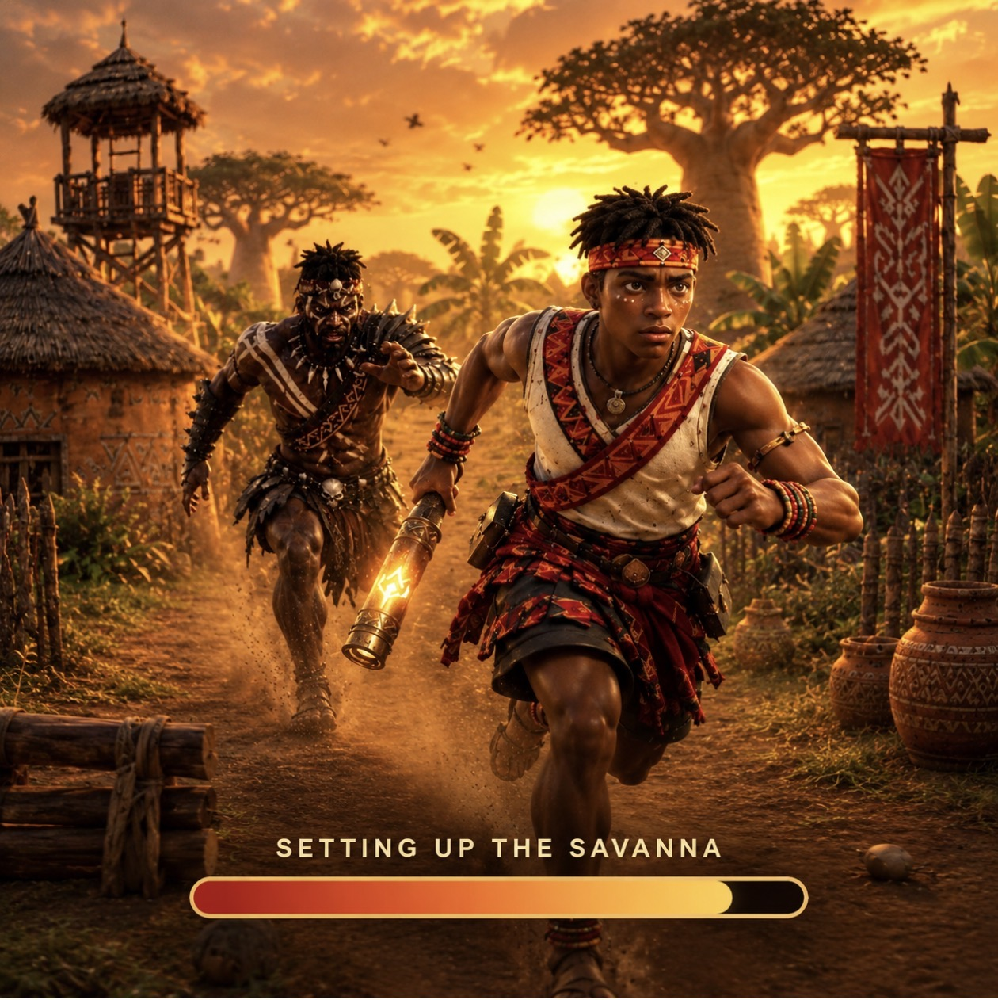
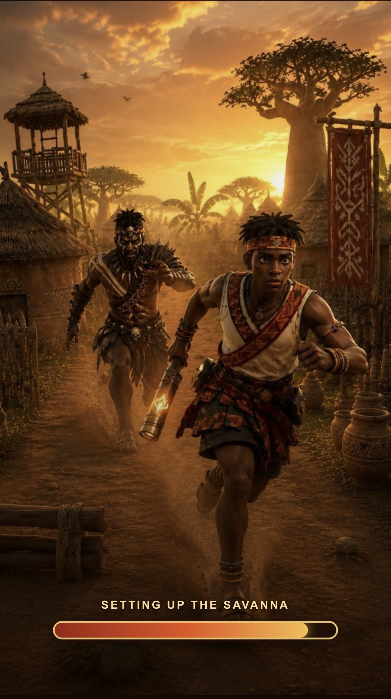
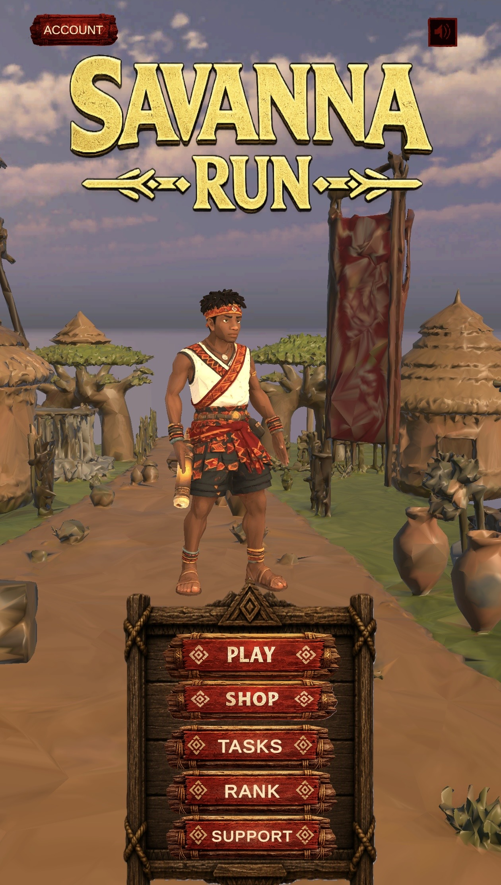
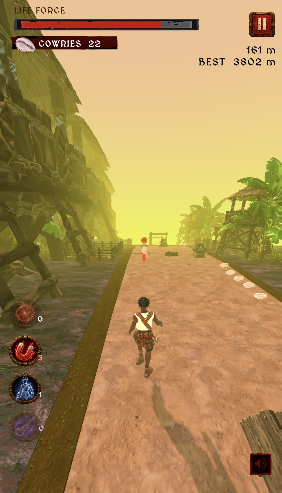
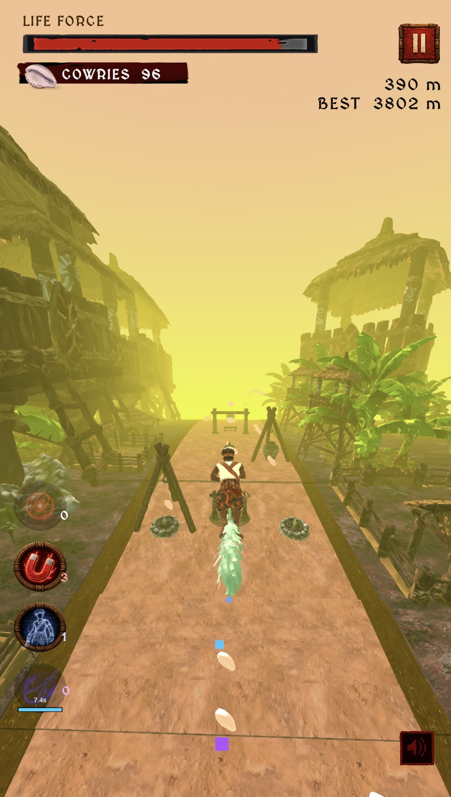
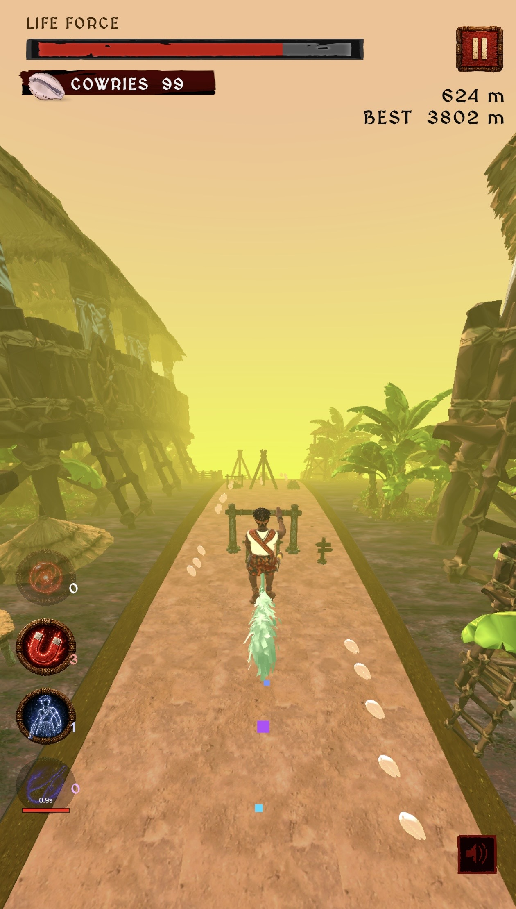

# Savanna Run

> Run the path, Carry the story.

| Field | Value |
| --- | --- |
| Category | Games |
| Pricing | Free |
| Team name | W Team |
| Team members | Winnifred - CEO, Samuel - CTO |
| X account | real_winni3 |
| Heard about it via | On X (twitter) |
| Contact email | wovenpathstudios@gmail.com |
| GitHub login | @Oputasamuel |
| Submitted at | 2026-09-16T14:23:27.907Z |

## Links

| Link | URL |
| --- | --- |
| Repo | [https://github.com/Oputasamuel/Savanna-Run](<https://github.com/Oputasamuel/Savanna-Run>) |
| Demo | [https://savanna-run.xyz](<https://savanna-run.xyz>) |
| Video | [https://youtu.be/RAEWGsUgQk8?is=oImnBrrazTR31MAR](<https://youtu.be/RAEWGsUgQk8?is=oImnBrrazTR31MAR>) |
| Skool post | [https://www.skool.com/miniappscompetition/update-on-savanna-run-2?p=b399755b](<https://www.skool.com/miniappscompetition/update-on-savanna-run-2?p=b399755b>) |
| Social post | [https://x.com/real_winni3/status/2097996601725772130?s=46](<https://x.com/real_winni3/status/2097996601725772130?s=46>) |

## Description

Savanna Run, a free-to-play African-themed endless runner, invites players to guide Kesi through vibrant landscapes inspired by African environments and stories.

## Builder story

Savanna Run was inspired by a desire to see more African stories, characters and environments represented in gaming.

Growing up, we were surrounded by incredible cultures, landscapes, music and stories. However, when we look at many of the games we play, these experiences aren’t always reflected. So, we wanted to create something that feels familiar to us but is still exciting to anyone around the world.

This idea evolved into Savanna Run, an endless runner where players follow Kesi through markets, the savanna, riversides and ancient ruins, collecting the Ember Baton and discovering a world inspired by Africa.

We’re not aiming to create a game that feels like a history lesson, Instead, we want to capture the beauty and imagination of Africa and transform it into something playful, adventurous and memorable.

At its core, Savanna Run is our way of demonstrating that African stories can serve as the foundation for games that people from all over the world can enjoy.

Private dashboard: https://oputasamuel.github.io/Savanna-Run-Admin-Site/

Web: www.savanna-run.xyz

## Thumbnail

## Screenshots

---

_Generated from the submission form. `submission.yaml` in this folder is the machine-readable source of truth._
