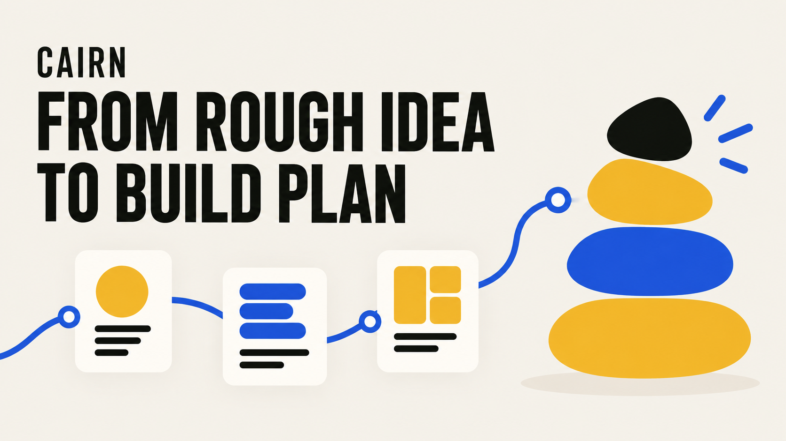
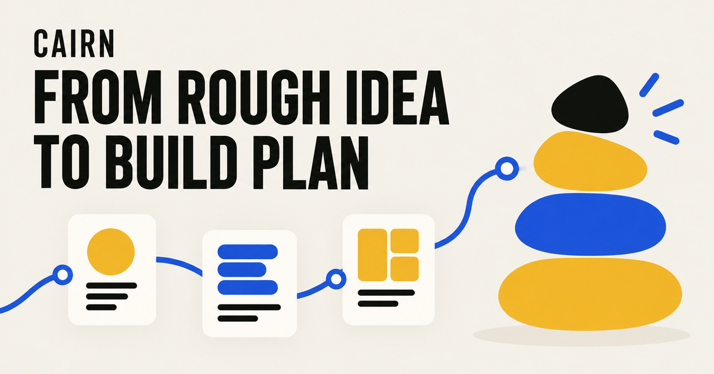
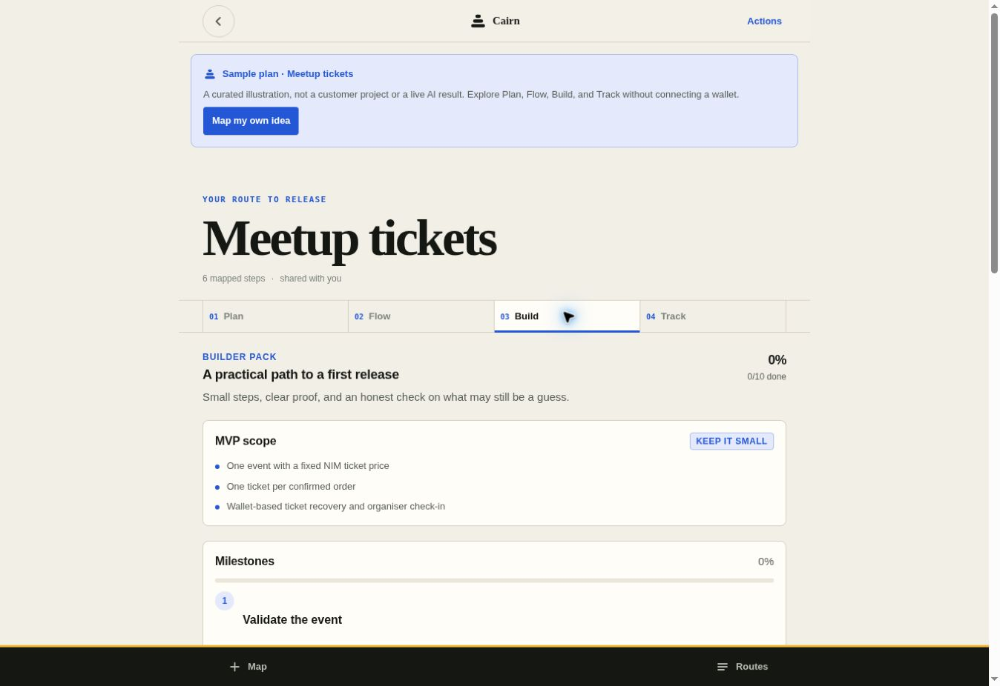
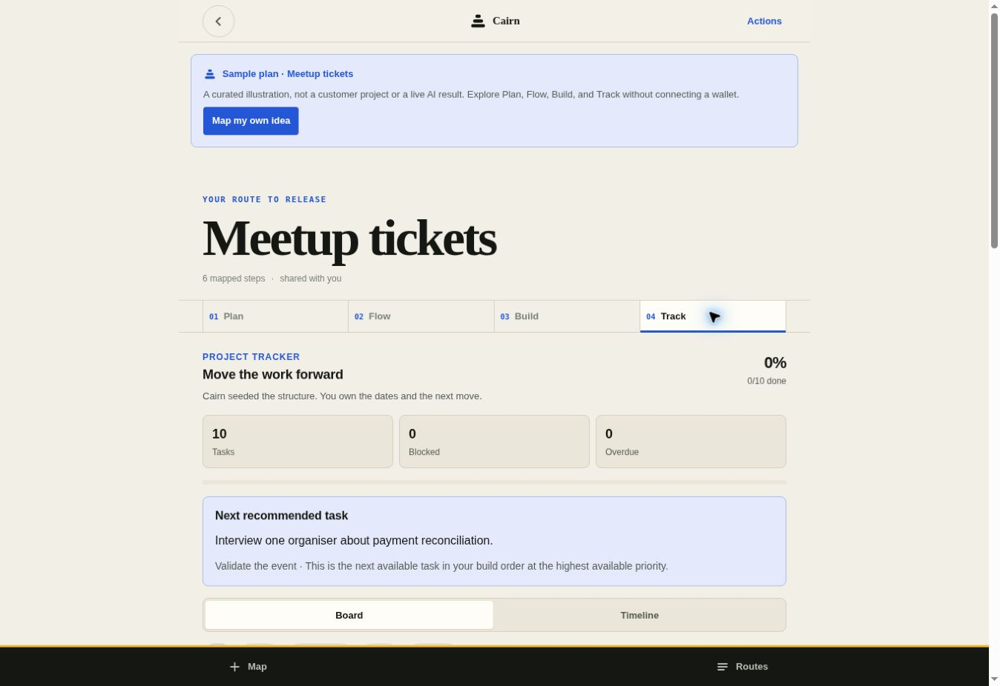

# Cairn

> Map the idea before you build it.

| Field | Value |
| --- | --- |
| Category | Productivity |
| Pricing | Free |
| Team name | Akanbi Labs |
| Team members | Codex |
| X account | Akanbilabs |
| Heard about it via | X |
| Contact email | toheebmuraina@gmail.com |
| GitHub login | @Teecash96 |
| Submitted at | 2026-09-16T15:46:02.079Z |

## Links

| Link | URL |
| --- | --- |
| Repo | [https://github.com/Teecash96/Cairn](<https://github.com/Teecash96/Cairn>) |
| Demo | [https://cairn.cairn-planner.workers.dev/](<https://cairn.cairn-planner.workers.dev/>) |
| Video | [https://youtube.com/shorts/OeXfguGt24A](<https://youtube.com/shorts/OeXfguGt24A>) |
| Skool post | [https://www.skool.com/miniappscompetition/cairn-a-mini-app-for-nimiq-pay?p=47e995d2](<https://www.skool.com/miniappscompetition/cairn-a-mini-app-for-nimiq-pay?p=47e995d2>) |
| Social post | [https://x.com/akanbilabs/status/2100212454345134313?s=46](<https://x.com/akanbilabs/status/2100212454345134313?s=46>) |

## Description

Cairn is an AI planning workspace inside Nimiq Pay that turns a rough product idea into an editable PRD, visual map, user flow, MVP build plan, and task tracker—so builders know what to create and what to do next.

## Builder story

I built Cairn because I have had good ideas that felt clear in my head but became difficult when I tried to turn them into real products.

The first step was always the hardest. I had to define the user, choose the main features, map the user journey, reduce the scope, and decide what to build first. Sometimes the idea ended as scattered notes or a long AI conversation that I never used again.

ChatGPT can write a product plan, but its answer remains inside a conversation. I still had to extract the decisions, create the tasks, track the work, and explain the plan again when a teammate joined.

That problem inspired Cairn.

Cairn turns a rough idea into one connected workspace. It creates an editable product brief, visual map, user flow, MVP scope, milestones, risks, acceptance tests, and task tracker.

Cairn also helps a team execute the plan. The project owner can invite specific teammates through their Nimiq wallet addresses and share the Track workspace with them. Teammates can work on tasks, priorities, dates, and blockers while the main product plan stays private. The wallet verifies who can enter, without another account or password.

A general AI chat can suggest what to build. It does not provide Cairn’s wallet-controlled team workspace for managing the work after the answer.

I built Cairn to remove the blank page, reduce confusion, and help one person or a trusted team turn a good idea into a product they can ship.

## Thumbnail

## Screenshots

---

_Generated from the submission form. `submission.yaml` in this folder is the machine-readable source of truth._
