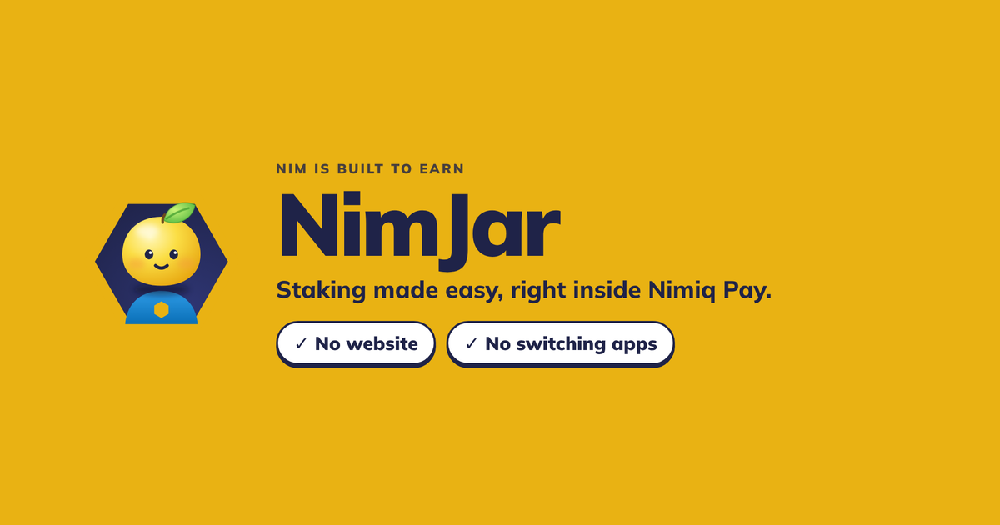
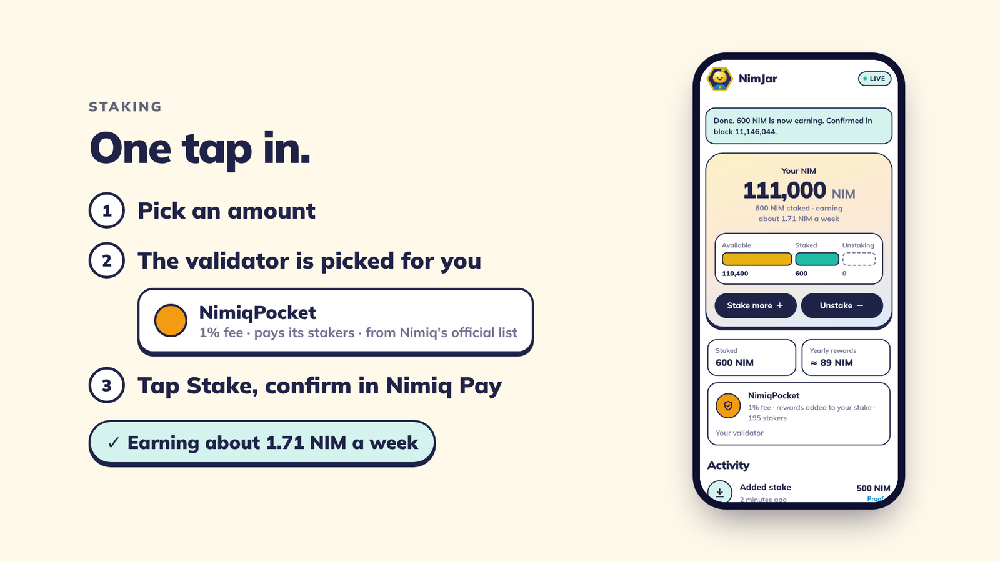
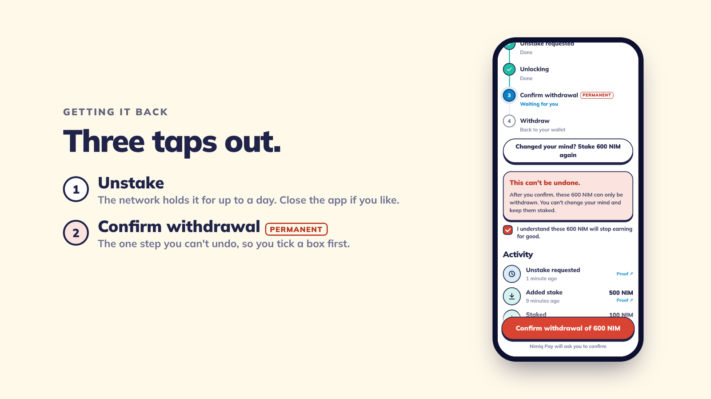
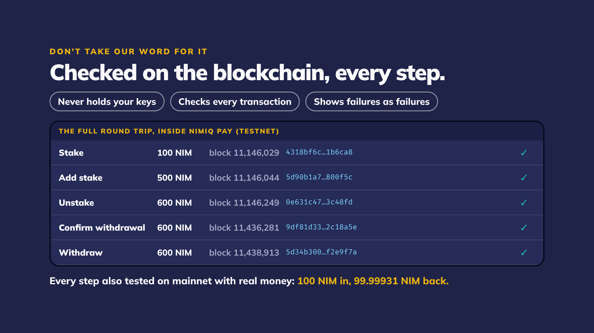
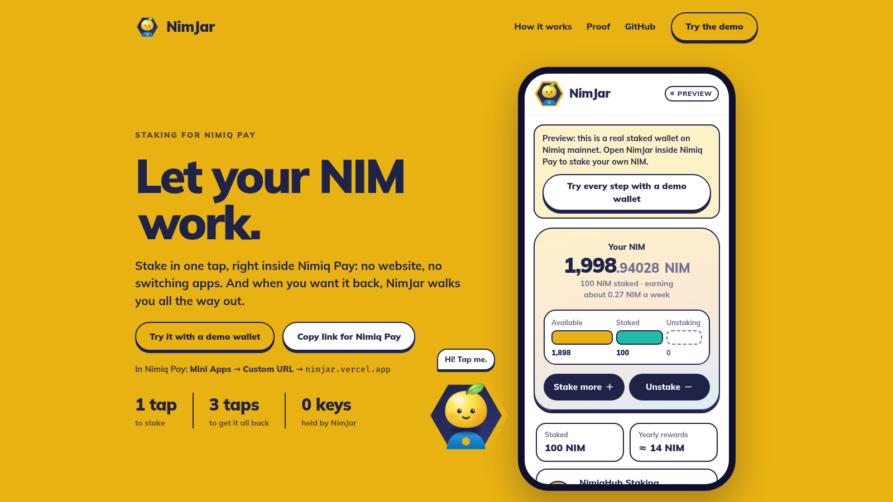

# Nimjar

> Staking made easy, right inside Nimiq Pay.

| Field | Value |
| --- | --- |
| Category | Earning |
| Pricing | Free |
| Team name | _Not provided — optional_ |
| Team members | _Not provided — optional_ |
| X account | imprint_0x |
| Heard about it via | _Not provided — optional_ |
| Contact email | imprint76810@gmail.com |
| GitHub login | @imprint-hash |
| Submitted at | 2026-09-16T17:20:58.936Z |

## Links

| Link | URL |
| --- | --- |
| Repo | [https://github.com/imprint-hash/nimjar](<https://github.com/imprint-hash/nimjar>) |
| Demo | [https://nimjar.vercel.app](<https://nimjar.vercel.app>) |
| Video | [https://youtu.be/kdteO8o3_hQ](<https://youtu.be/kdteO8o3_hQ>) |
| Skool post | _Not provided — optional_ |
| Social post | [https://x.com/imprint_0x/status/2100265736170099108?s=20](<https://x.com/imprint_0x/status/2100265736170099108?s=20>) |

## Description

NimJar lets you stake NIM right inside Nimiq Pay: no website, no switching apps. It picks a validator that pays its stakers, shows what you earn each week, and walks you through every step to get your NIM back and claim your reward.

## Builder story

A few weeks ago I joined the Nimiq Telegram for the first time, and I noticed someone struggling to find NIM they had unstaked. They kept asking, "Where is my NIM?"

So I did a little research. I found out you can't stake from Nimiq Pay at all: you have to go to the Nimiq Wallet website. And getting staked NIM back is confusing: it takes three separate steps, a wait of up to a day, and one step that can't be undone. It's easy to lose track of where your NIM is.

So I built NimJar, a mini app that lets you stake your NIM in one tap, right inside Nimiq Pay, and get it back whenever you want. It shows you exactly where your NIM is at every moment (available, staked, or on its way back), counts down the wait, and walks you through each step, so nobody has to ask "where is my NIM?" again.

## Thumbnail

## Screenshots

---

_Generated from the submission form. `submission.yaml` in this folder is the machine-readable source of truth._
