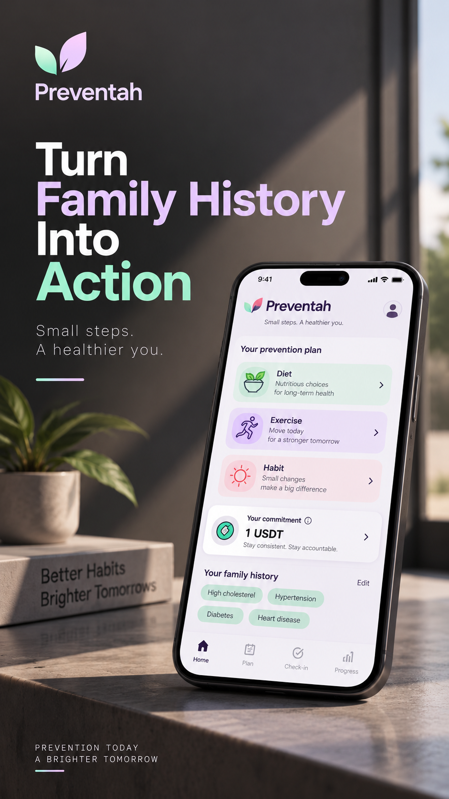
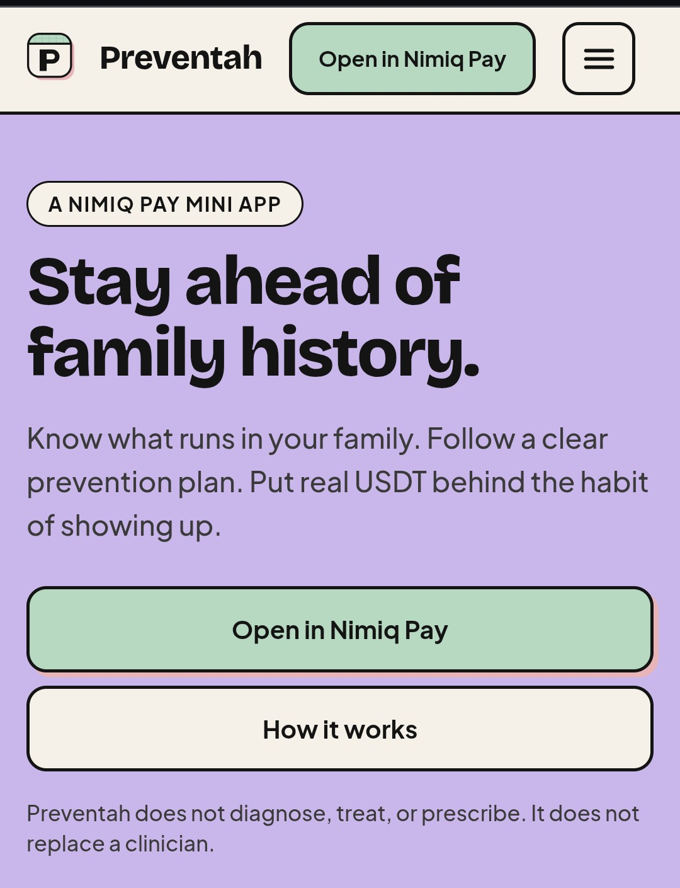
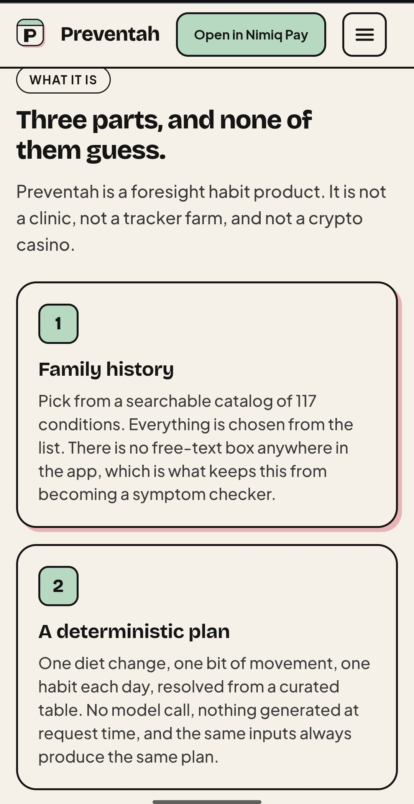
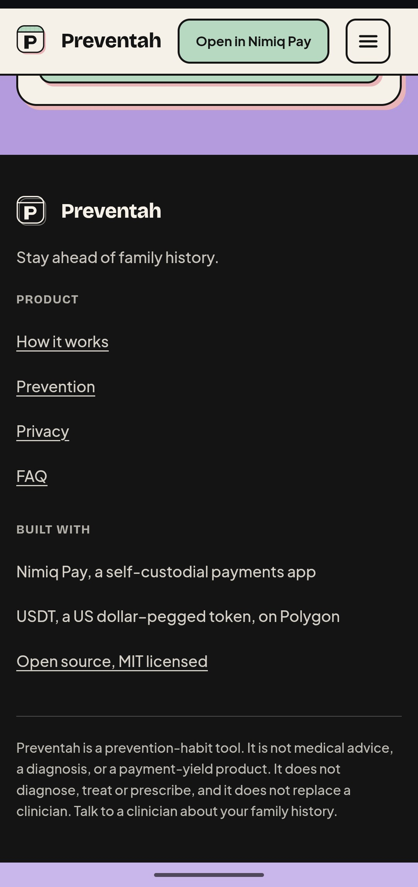

# Preventah

> It runs in the family. Don’t let it run you.

| Field | Value |
| --- | --- |
| Category | Health & fitness |
| Pricing | Free |
| Team name | _Not provided — optional_ |
| Team members | _Not provided — optional_ |
| X account | levithefirst |
| Heard about it via | X |
| Contact email | leviweb3x@gmail.com |
| GitHub login | @levithefirst |
| Submitted at | 2026-09-16T15:39:26.430Z |

## Links

| Link | URL |
| --- | --- |
| Repo | [https://github.com/levithefirst/preventah](<https://github.com/levithefirst/preventah>) |
| Demo | [https://preventah-nimiq.vercel.app](<https://preventah-nimiq.vercel.app>) |
| Video | [https://youtube.com/shorts/rGqeUB44xC8?si=QJxuasDhG-5AzVyV](<https://youtube.com/shorts/rGqeUB44xC8?si=QJxuasDhG-5AzVyV>) |
| Skool post | [https://www.skool.com/miniappscompetition/preventah?p=93bbe2ab](<https://www.skool.com/miniappscompetition/preventah?p=93bbe2ab>) |
| Social post | [https://x.com/levithefirst/status/2100245864786653687](<https://x.com/levithefirst/status/2100245864786653687>) |

## Description

Preventah helps people who know a condition runs in their family turn that history into a daily prevention routine. It creates a clear plan for food, movement, and habits, with daily check-ins, optional measurements, reminders, and a USDT commitment to stay consistent.

## Builder story

Preventah started with something personal. My maternal grandmother had dementia, and now my mom is showing signs of it. Seeing that happen made me realize I don't want to simply wait and find out whether the same thing happens to me.

I wanted a practical way to take action instead of just knowing that a health risk runs in my family. So I built Preventah to turn that awareness into a daily prevention routine with a personalized plan, check-ins, optional measurements, reminders, and a USDT commitment to keep showing up.

The goal is to help me actively work towards a healthier future instead of waiting until it is too late.

## Thumbnail

## Screenshots

---

_Generated from the submission form. `submission.yaml` in this folder is the machine-readable source of truth._
