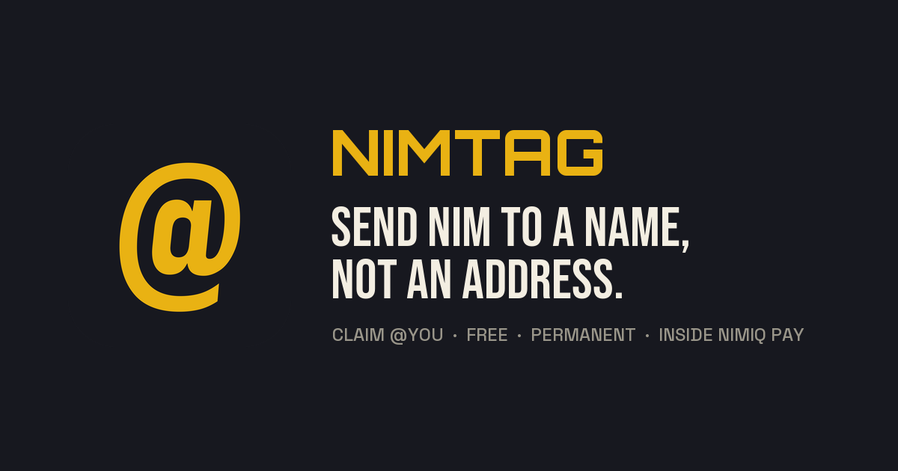
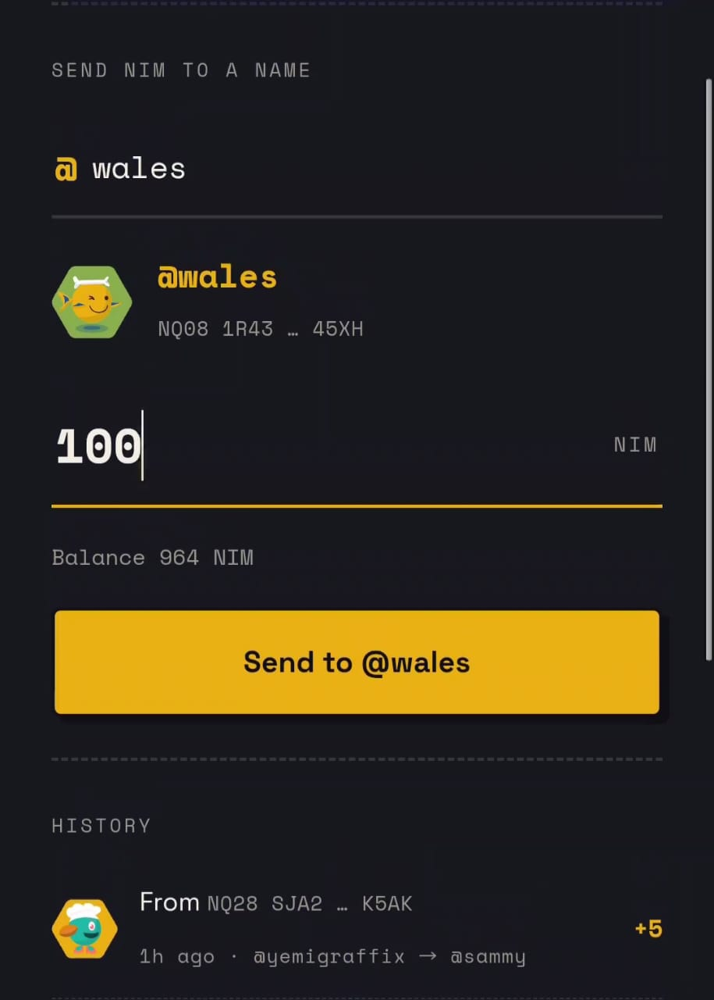
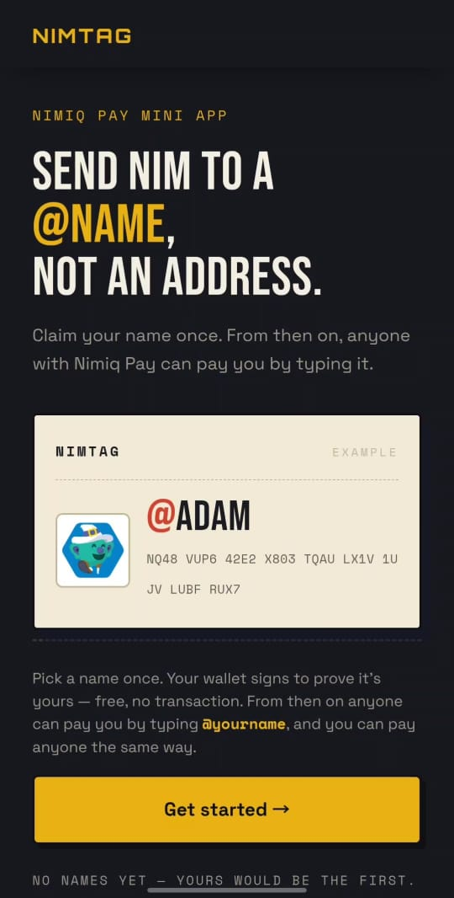
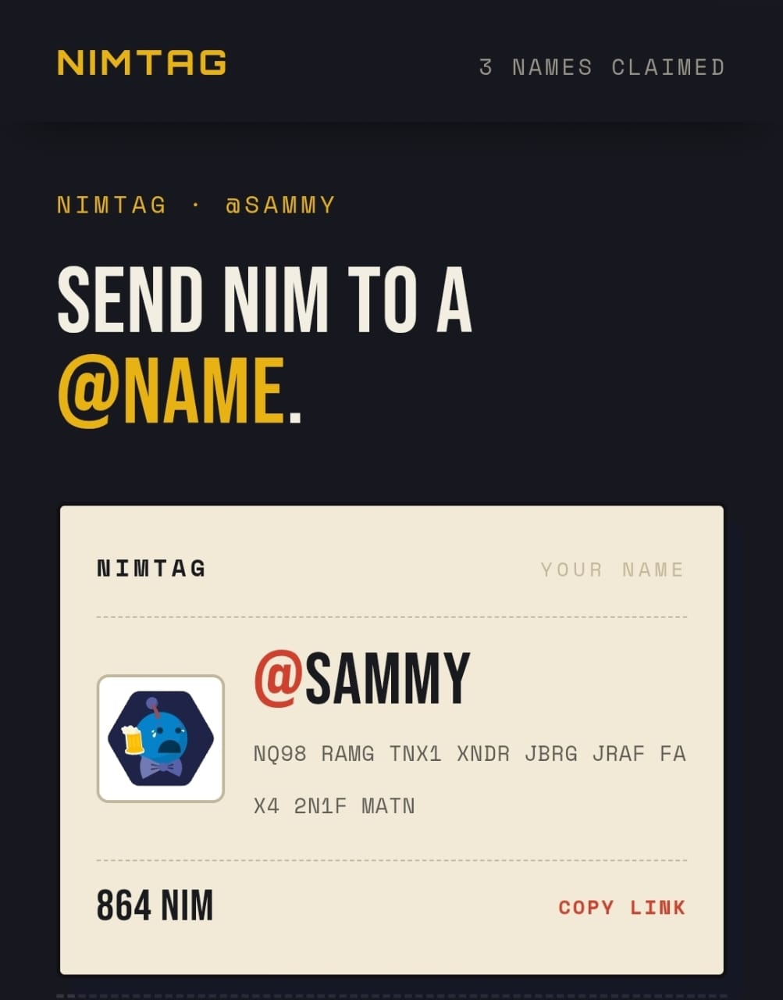

# Nimtag

> Send NIM to a name, not an address

| Field | Value |
| --- | --- |
| Category | On-chain services |
| Pricing | Free |
| Team name | _Not provided — optional_ |
| Team members | _Not provided — optional_ |
| X account | sammyxxiv |
| Heard about it via | X (formerly twitter) |
| Contact email | samsonsamuel531@gmail.com |
| GitHub login | @sammy-XXIV |
| Submitted at | 2026-09-16T21:21:47.125Z |

## Links

| Link | URL |
| --- | --- |
| Repo | [https://github.com/sammy-XXIV/nimtag](<https://github.com/sammy-XXIV/nimtag>) |
| Demo | [https://nimtag-production.up.railway.app](<https://nimtag-production.up.railway.app>) |
| Video | [https://youtube.com/shorts/FbRTV-sKB2w?si=ZJ6pZPQMdPuQuYGy](<https://youtube.com/shorts/FbRTV-sKB2w?si=ZJ6pZPQMdPuQuYGy>) |
| Skool post | _Not provided — optional_ |
| Social post | [https://x.com/sammyXXIV/status/2100307719672443336?s=20](<https://x.com/sammyXXIV/status/2100307719672443336?s=20>) |

## Description

Claim @you once — your wallet signs, nothing is sent — and anyone in Nimiq Pay can pay you by typing your name. No addresses, no QR, no account. Send to @friends the same way, with your name on the transaction.

## Builder story

A friend of mine once sent NIM to the wrong address. He copied it from a chat, missed one character, and it was gone - not stolen, just gone to nobody. There’s no undo on a chain and no one to call. That’s why Nimtag exists.

Nobody should have to type, copy, or squint at a 36-character address to pay someone they know.

With Nimtag, you claim a name once. Your wallet signs a short message proving the address is yours, free, with no transaction , and the name is yours permanently.

From then on, anyone using Nimiq Pay can type your name, see your identicon to confirm it’s you, and send NIM. Every payment carries `@you → @them` in the memo, making transfers readable on-chain by name.

Names are permanent: one per wallet, never changed, sold, or transferred.

Building Nimtag also taught me something about Nimiq Pay itself: mini apps receive an address, while Nimiq Pay automatically moves incoming NIM into internal accounts. Nimtag follows that flow, so the balance and transaction history you see are real, not just an empty front door.

Nimiq Pay is the wallet. Nimtag is who you send to.

It’s live and open source under MIT. Nimtag holds nothing but names — no keys, no funds, no accounts.

Three people claimed names on day one, and that made me realize that i can solve part of the major onchain problems

## Thumbnail

## Screenshots

---

_Generated from the submission form. `submission.yaml` in this folder is the machine-readable source of truth._
