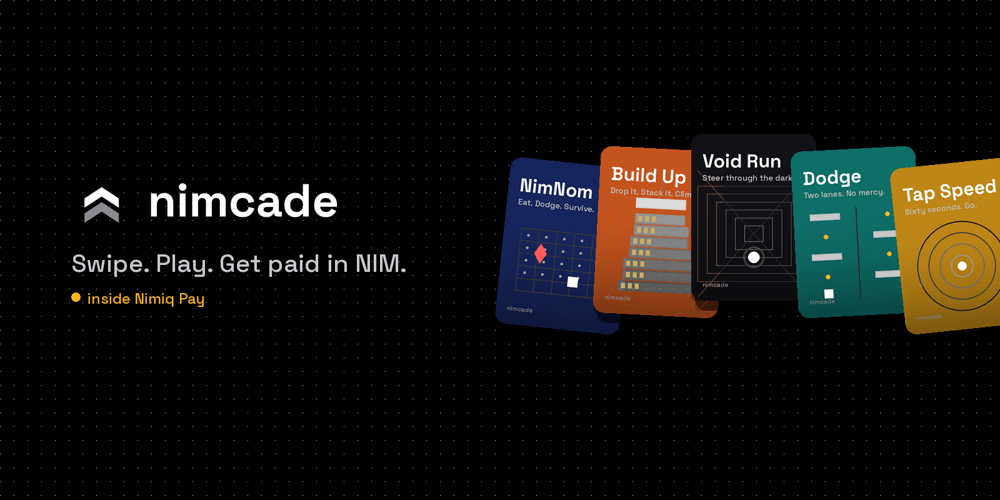
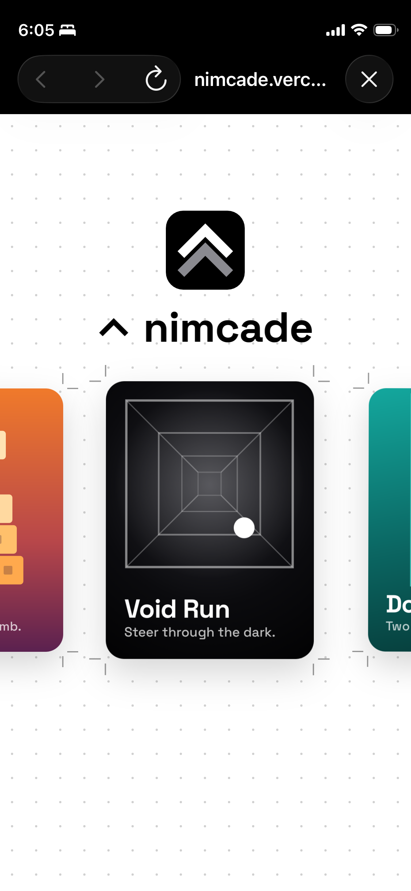
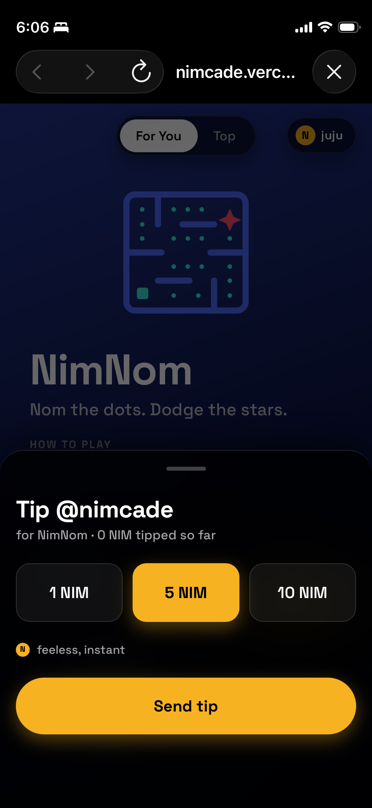
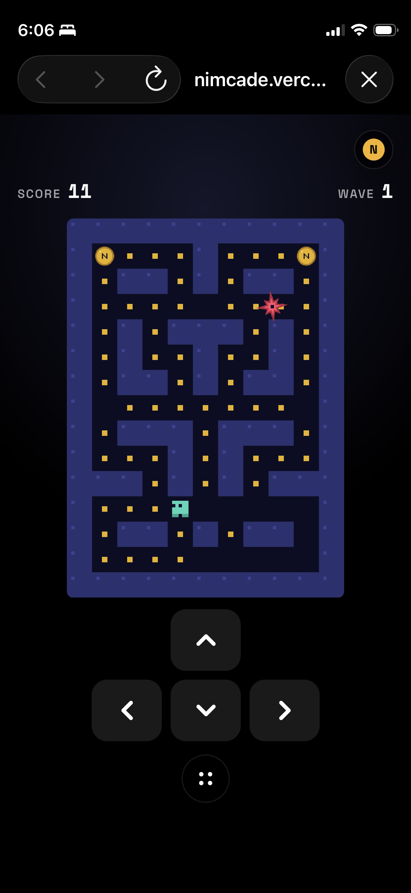
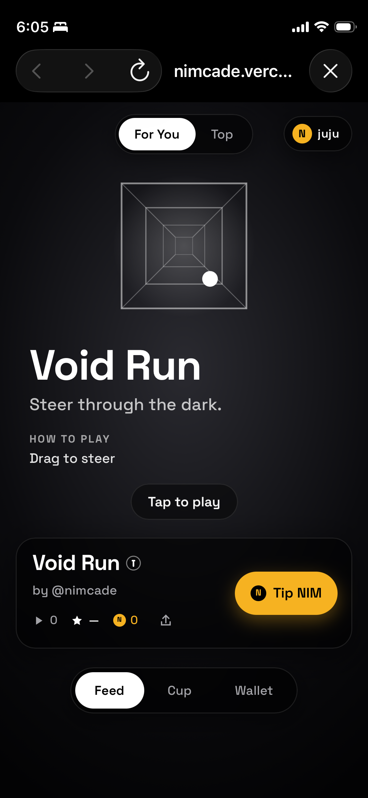
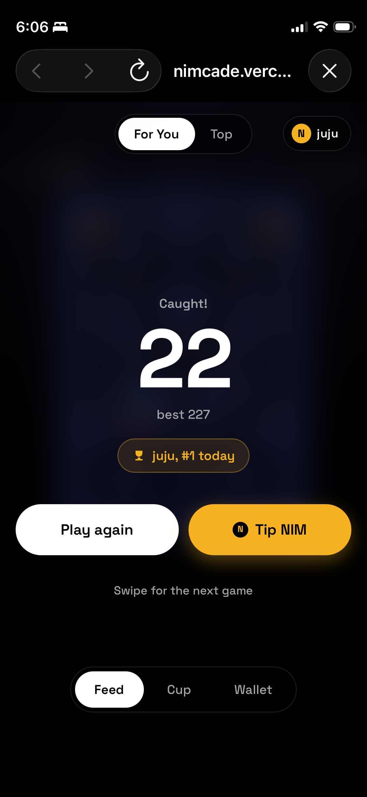

# nimcade

> Swipe. Play. Get paid.

| Field | Value |
| --- | --- |
| Category | Games |
| Pricing | Free |
| Team name | _Not provided — optional_ |
| Team members | _Not provided — optional_ |
| X account | shroomsgotsol |
| Heard about it via | X |
| Contact email | rukevwe.eminokanju08@gmail.com |
| GitHub login | @shrooms08 |
| Submitted at | 2026-09-16T10:49:26.389Z |

## Links

| Link | URL |
| --- | --- |
| Repo | [https://github.com/shrooms08/nimcade](<https://github.com/shrooms08/nimcade>) |
| Demo | [https://nimcade.vercel.app/](<https://nimcade.vercel.app/>) |
| Video | [https://youtu.be/HfejZJ6pPZA](<https://youtu.be/HfejZJ6pPZA>) |
| Skool post | [https://www.skool.com/miniappscompetition/intro?p=7e4b28d6](<https://www.skool.com/miniappscompetition/intro?p=7e4b28d6>) |
| Social post | [https://x.com/shroomsgotsol/status/2100175087148183940?s=46](<https://x.com/shroomsgotsol/status/2100175087148183940?s=46>) |

## Description

A TikTok-style swipe feed of five endless arcade games inside Nimiq Pay. Tip a game's maker in NIM with one tap, sign your score to enter its Daily Cup, and the top 3 get paid from the pool automatically every day. Live on mainnet.

## Builder story

I'm a solo developer from Benin City, Nigeria.

## Thumbnail

## Screenshots

---

_Generated from the submission form. `submission.yaml` in this folder is the machine-readable source of truth._
